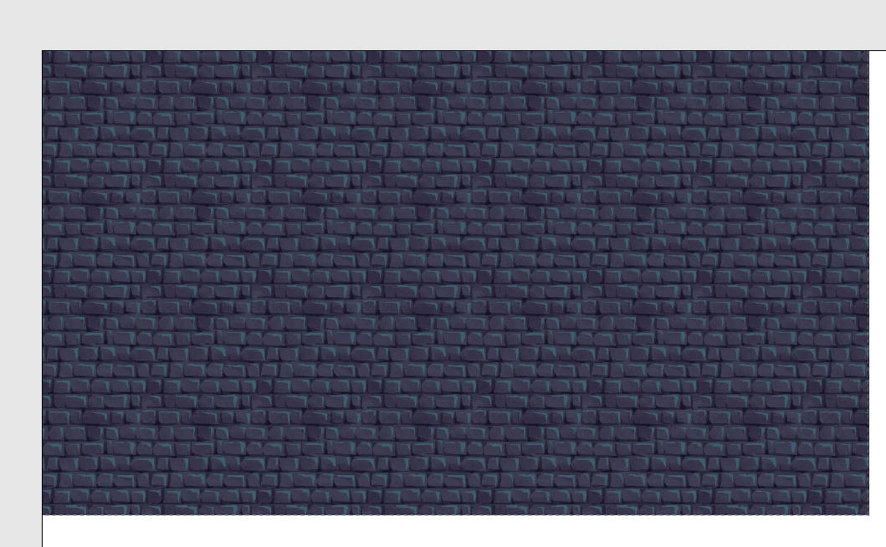

# construct3_mega

## 目录
- 1.[游戏背景](#游戏背景)
- 2.[游戏在线编程工具](#游戏在线编程工具)
- 3.[游戏实现步骤](#游戏实现步骤)
- 4.[游戏可拓展的思路](#游戏可拓展的思路)
- 5.[游玩链接](#游玩链接)
- 6.[游戏demo展示链接](#游戏demo展示链接)

## 1.游戏背景

在荒废的邪恶古堡深处，阴冷的空气中弥漫着死亡的气息。哥布林群在黯淡的火把下，准备着他们的下一次阴谋。然而，一位神秘的法师悄然出现在古堡的长廊尽头，斗篷在微风中轻轻飘扬，手中的法杖闪烁着炽热的火焰。他低声念诵着古老的咒语，脚下的石砖仿佛在他的力量下微微震动。古堡的天空乌云密布，雷声隐隐。哥布林们感受到一股危险的气息，发出尖锐的叫声，挥舞着生锈的武器冲向法师。
就在这一刻，法师果断挥动法杖，一颗巨大的火球从天而降，划破夜空，狠狠砸向最前方的敌人。炽热的火焰瞬间吞噬了冲锋的哥布林，烧灼的气浪席卷整个大厅。剩余的哥布林惊慌失措，四散而逃，但他们的退路早已被封锁。随着法师最后一句咒语的落下，火光渐熄，邪恶的古堡再次陷入了寂静。

## 2.游戏在线编程工具

https://www.construct.net/

## 3.游戏实现步骤

### 1) 新建项目
点击页面的新建项目，开始创建！

  

    
    
  

接下来出现设置具体的场景属性设置，我们不对预设尺寸等属性进行更改。

 

    
    
  

### 2) 添加对象
#### i.添加游戏的背景
为了契合游戏的背景选择了以像素风的石砖作为背景。

    

  

具体操作就是双击布局来创建，选择常规中的平铺图

 

    
    
  

接下来就是将这个石砖铺满整个布局，于是点击在布局中对应的图像，在右侧的属性栏中更改坐标和大小,

我们改为（0，0）坐标和 1921x1084 的大小使得背景铺满整个页面！

 

    
    
  

得到了如下图的效果：
 

    
    
  

#### ii.添加其他对象

- 1.法师（玩家）
  

    
    

- 2.哥布林
  

    
    

- 3.火球
  

    
    
  
    
- 4.闪耀特效
      

    
    

- 5.鼠标
  
添加方法和上面类似双击布局，选择常规中的精灵模块进行添加，<mark>注意不同的对象应该有不同的名字。</mark>
   
 

    
    

<mark>注意要将火球和闪耀特效放置在场景外面！</mark>

#### iii.创建更多的哥布林对象
为了保证游戏的合理性,以及具有一定的挑战性，在游戏的开始添加了8个哥布林对我们操控的法师进行冲撞攻击！
将哥布林对象拖拽值布局当中均匀分布在我们玩家周围！
其中的哥布林其实就是相当于“类”的概念，拖拽生成的就是哥布林的实体对象！

 

    
    
  

### 3)添加行为
需要对添加的对象进行行为的添加~
8方向移动：这允许您使用方向键移动对象。这对玩家的移动有好处。
子弹移动：使对象以当前角度向前移动。适用于哥布林，和火球的移动方式。
镜头跟随：使屏幕在对象移动时跟随对象移动。
绑定到布局：这将阻止对象离开布局区域。这对玩家也很有用，这样他们就不能在游戏区域外徘徊了！
出界销毁：这不是阻止对象离开布局区域，而是销毁它。离开布局后会销毁它们。
淡入淡出：使对象淡出，我们将在火花闪烁时使用

如何添加行为？
找到右侧栏里面的行为的模块

 

    
    
  

    
选择上面提到的行为对不同的对象进行添加！

 

    
    
  
    

### 4)实体变量添加
为了符合正常现象，我决定对哥布林进行实体变量health的添加。

使得被攻击一定次数后哥布林会死亡。

 

    
    

### 5)添加事件
#### i.玩家始终指向鼠标
点击事件表1,开始添加事件。

 

    
    

    
之后选择系统对象作为事件的条件的对象，每一帧法师（玩家）都会指向鼠标作为事件的动作！

 

    
    

 

    
    

 

    
    

 

    
    

朝向方向就是鼠标的坐标（m.X,m.Y）
  
最终我们得到了我们创建的第一个事件

 

    
    
  

#### ii.玩家释放火球术
当玩家点击时，他们应该施放一个火球术。

可以通过点击鼠标左键进行释放，并沿着鼠标方向进行移动。
因此得到了以下事件：（具体细节操作同i，以下省略）

 

    
    
  
    
#### iii.场景内生成哥布林
为了能进行持续的游玩，我们决定每1.5s在场景内随机位置生成哥布林。

  

 

    
    
   
与此同时哥布林会持续向玩家方向进行冲锋！  

 

    
    
  

#### iv.火球术击中哥布林
当法师释放的强大火球术与哥布林发生碰撞，哥布林会受到一定伤害，并且进入暴怒状态速度会逐渐增加。
于此同时火球术在未击杀哥布林是会被销毁。
 

    
    
  

当哥布林在被击中后血量少于0的时候会自动销毁并释放闪耀的死亡特效！

 

    
    
  

<mark>以下是拓展增强分内容</mark>

#### v.得分事件
为了增加游戏的娱乐性以及挑战性，进一步满足玩家的需求，决定添加了得分事件！

即每次击杀一只哥布林都会在界面的左上角的Score增加一分。

 

    
    
   

这需要设置一个全局变量Score来记录得分并显示在左上角

 

    
    
  

#### vi.哥布林攻击命中玩家
当哥布林的猛烈攻击击中玩家是就会游戏结束，得分清零，一代法王就此陨落（角色销毁）。
最终跳出游戏结束的画面，并在3s后重载场景！
 

    
    

  
## 4.游戏可拓展的思路

## 5.游玩链接

https://bubnle.github.io/construct3_mega/  

## 6.游戏demo展示链接

